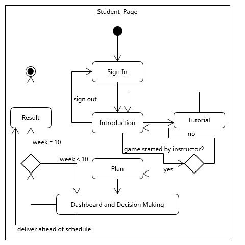

# ConstructionManagementSimulation

A web-based construction project management simulation (CPMS) game for MSc/BSc management students to play with an admin portal based on Spring Boot and Vue.js.

Inspired by [Harvard Business Simulation](https://hbsp.harvard.edu/simulations/).

# Preview

Gameplay Page:

Admin Page:

# Requirements

Before officially developing the game, the opinions of the instructors of the School of Management at University of Bristol have been collected. According to the requirements of the clients in the School of Management at University of Bristol and the user stories above, Two activity diagrams have been created which are shown below.

# Database Structure

According to the the requirements mentioned above, the MySQL Database of the CPMS is based on the ER diagram shown below.

Note that in the table called seminars, “scd” stands for supply chain disruptions; “ls” stands for labour strike; “sef” stands for sudden equipment failure; “rc” stands for regulatory changes, which are the number of week that different unexpected events take place in accordance with the instructor's setting.

# Back End Design

During the development of the CPMS, a front-end and back-end separated architecture was adopted. In order to ensure its robustness and efficiency, the back-end service is based on the Spring framework and its extension Spring Boot. MyBatis framework is also used to map database and Java objects. The class diagram is as followed.

# Front End Design

The front end of the CPMS is based on the Vue.js framework. The two sequence diagrams below show how different Vue.js components are arranged and interact with users on the instructor page and the student page respectively.

# Gameplay Design

Acomplete game run of the CPMS takes around half an hour long. Students are supposed to read the instructions and tutorial carefully first. Before the game starts, there is a planning phase that allows students to make an initial plan and familiarize themselves with the different metrics in the game. During the planning phase, students can decide the height of the building they wish to construct and see the corresponding material and labour expenditure, but any consequences caused by unanticipated events will not be taken into consideration, neither will shipment cost or storage cost. So during the actual game, students can be aware of the difference between plan and reality. Thus they are encouraged to reassess the validity of of their plan afterwards.

To fully simulate the project management in reality, unlike the hardware store inventory simulation game mentioned before, in the CPMS gameplay, students are not only asked to decide how many materials they need to purchase each week but they are also allowed to customize the size of their construction teams every week. They have to keep a balancebetween material inventory and labour force so as to maximize work efficiency while preventing overstocking. They also need to be constantly prepared to deal with a range of unexpected events that can dramatically influence the material cost or delay the project’s progress. If the material is too much, they are likely to receive a stockout penalty. If an oversized construction team is hired, students can waste money on a surplus labour force. In one word, all they need to do is construct the tallest building possible with the least amount of expenditure.

In order to make the simulation more closely align with the actual conditions in the real world, the metrics in the game should also align with reality. It is a big challenge to design realistic metrics while maintaining game balance. It is also difficult to collect precise data such as the expenditure breakdown of a construction site. So I tried to ask ChatGPT a set of questions such as “what is the approximate cost for materials and labour to construct a building that is around 70 meters high” and “what percentage is typically allocated for material costs and what percentage for labour costs in this
approximate cost” and modified game metrics according to ChatGPT’s answers. Also, to mirror the actual circumstances and make the game more challenging, the material cost will slightly fluctuate every week even if nothing happens and the labour cost will increase as the building reaches a certain height. Additionally, students can choose to deliver the project ahead of schedule at any time if they feel it is OK to do so to reduce the shipment and storage costs.
